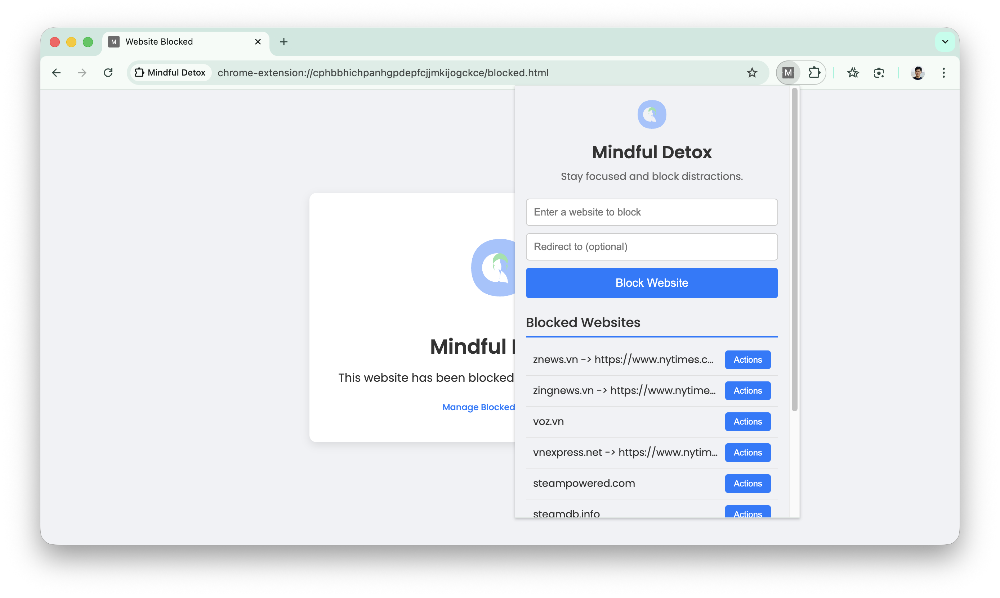

# Mindful Detox

## Product Overview

Mindful Detox is a Chrome extension designed to help you break the habit of passively consuming toxic content from the internet. Stay focused and block distractions by preventing access to websites that waste your time or negatively impact your wellbeing.

### Features

- **Website Blocking**: Block any website with a simple interface
- **Custom Redirects**: Optionally redirect blocked sites to productive alternatives
- **Mindful Browsing**: Break unconscious browsing habits and regain control of your attention

The extension is built using HTML, CSS, and JavaScript.

# Building and Running

To run this extension, follow these steps:

1.  Open Chrome and navigate to `chrome://extensions`.
2.  Enable "Developer mode".
3.  Click on "Load unpacked" and select the directory containing this project.

The extension will be installed and ready to use.

# Development Conventions

The project follows a simple structure for a Chrome extension:

*   `manifest.json`: The manifest file that defines the extension's configuration, permissions, and files.
*   `popup.html`, `popup.css`, `popup.js`: These files implement the extension's popup UI, which allows users to add and remove websites from the blocklist.
*   `background.js`: This is the service worker that runs in the background and contains the core logic for blocking and redirecting websites.
*   `blocked.html`, `blocked.css`: These files are used to display a message when a user navigates to a blocked website without a specified redirect.

The code is written in plain JavaScript, HTML, and CSS. There are no external libraries or frameworks used.